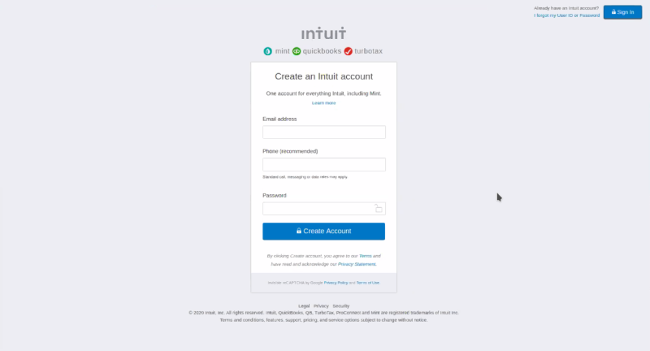

# Displaying and Inputting Data

This is an example of a web page with a form that allows the creation of a user account. The development of this page is part of the main curriculum of the Microvers program for web page development training.

This project was created with learning and practice purposes.

## Built With

- HTML
- CSS

## Live Demo

[Live Demo Link](https://maosan132.github.io/html-forms/)

## Authors

👤 **Author1**

- Github: [@meme-es](https://github.com/meme-es)

👤 **Author2**

- Github: [@maosan132](https://github.com/maosan132)

## 🤝 Contributing

Contributions, issues and feature requests are welcome!

Feel free to check the [issues page](/issues/).

## Show your support

Give a ⭐️ if you like this project!

## 📝 License

This project is free licensed.
